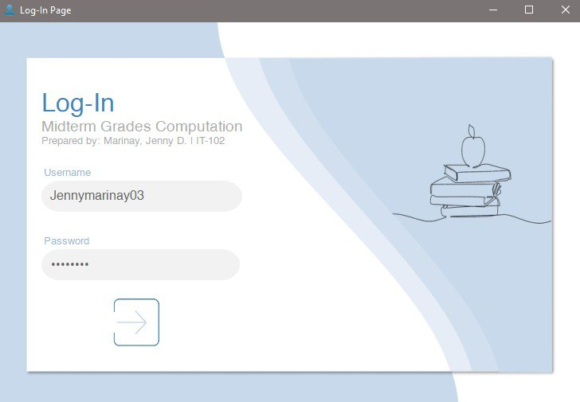
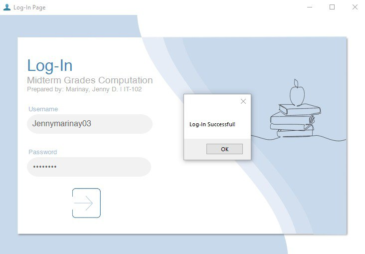
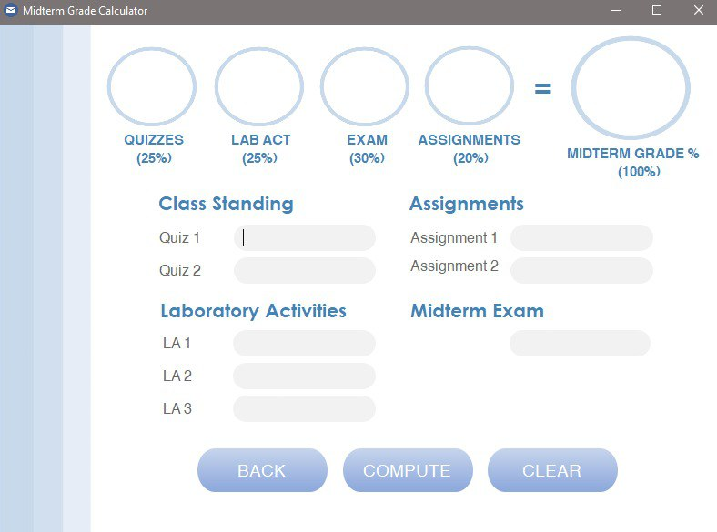
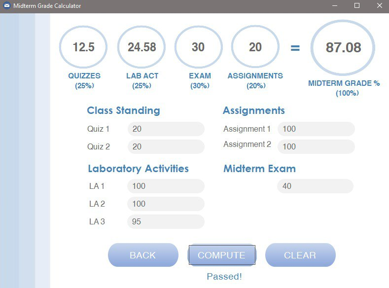

# Midterm Grade Computer - C# Windows Forms Application

## 📜 Description
This is a simple **Windows Forms** application designed to calculate and display midterm grades. It is built using **C#** and **.NET Framework**, offering a user-friendly interface to input and compute grades for a computer programming subjects. 🖥️

---

## 🚀 How to Run the Application (Using the Executable File)

1. **Download** the `Marinay - Lab Activity 1F.exe` file from the **Releases** section (located in the `bin/Debug` folder). 📥
2. Open the folder where you downloaded the `Marinay - Lab Activity 1F.exe` file.
3. **Double-click** the `Marinay - Lab Activity 1F.exe` file to launch the application. 🔥
4. Ensure your system meets the following requirements:
   - **Windows OS** 💻
   - **.NET Framework 4.7.2 or higher** installed 🔧

---

## 📸 Screenshots

### 1. Login Page


*The login screen where users enter their credentials.*
*Username: Jennymarinay03; Password: 12345678*


### 2. Login Success


*The page displayed after a successful login.*

### 3. Input Grades


*Main interface where users input grades for computer programming subjects.*

### 4. Output Grades


*The output screen displaying the final grades and pass/fail result.*
  
---

## 🔧 Features

- **Input grades** for computer programming subjects. ✏️
  
- **Calculate final grades** based on a weighted average. 📊

- **Display the pass/fail result** based on the computed grade. ✅❌

---

## 📁 Folder Structure
- **Executable**: The compiled `.exe` file can be found in the `bin/Debug` folder. 📂
- **Source Code**: The source files are available in the repository for reference and modification. 📂

---

## 🤝 Contributing
Contributions are welcome! If you'd like to contribute:
1. Fork the repository. 🍴
2. Create a new branch for your feature or bug fix:
   ```bash
   git checkout -b feature/YourFeatureName
